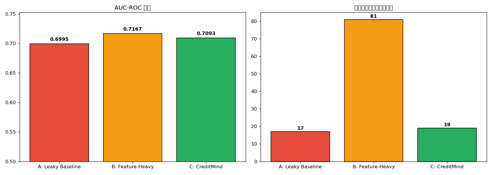
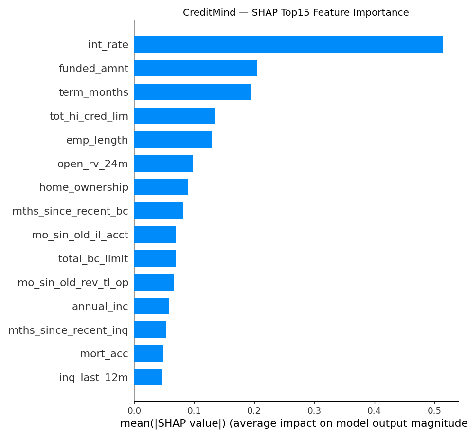

# 00 · 竞品分析与对比实验（Competitive Analysis）

> **CreditMind · AI 信贷风控大脑**
> 路演文档 — 2026-07-25 完成
> 数据来源：LendingClub 2018-2019 样本（150,000 行 × 87 列）

---

## 一、调研背景

在做 PRD v0.1 前，先调研四类竞品以确保 CreditMind 的差异化定位站得住脚：

| 类别 | 代表 | 调研目的 |
|---|---|---|
| **A. 大厂对公尽调 Agent** | 信贷智调 Agent（TRAE）、中电金信、云从、腾讯云 | 看「天花板」：大厂怎么打企业贷尽调 |
| **B. 海外 AI 信贷风控 Agent** | Underwrite.ai、Zentis.ai、LendingIQ、digiqt | 看产品形态：承保/尽调/违约预测分层 |
| **C. 开源 LendingClub 违约预测项目** | navyaneel/credit-risk-model、shashi-hue/loan-default-risk-system | 看模型层直接竞品：方法论差异 |
| **D. 智能信贷报告 SaaS** | 金锋报 FinDoc、达观 Agent | 看商业模式：报告自动生成路径 |

---

## 二、四类竞品全景

### 类别 A — 大厂对公尽调 Agent（"天花板"）

| 产品 | 厂商 | 核心能力 | AI 介入点 | 落地效果 |
|---|---|---|---|---|
| **信贷智调 Agent** | TRAE 大赛作品 | 现场采集+AI 访谈+OCR+交叉核验+风险预警+报告生成 | 事中实时介入 | 尽调效率提升 70%+ |
| **信贷尽调智能写作 Agent** | 中电金信 | 非结构化数据+小时级写作+金融级风控+系统集成 | 贷前辅助，1h 出报告 | 多家城商行落地 |
| **企信洞察** | 云从科技 | 股权穿透+财务拆解+ESG+授信建议+Word 报告 | 全维度企业透视，分钟级 | 10,000+ 份报告，500+ 企业 |
| **智能信贷助手** | 腾讯云 | 混元大模型+多模态文档解析+智能分析 | 对公尽调效率提升 10 倍 | 报告生成压缩到分钟级 |

**共性**：面向**对公/企业经营贷**，强调**多模态采集**（OCR/语音/拍照），依赖**大厂基础设施**（混元/大模型平台）。

### 类别 B — 海外 AI 信贷风控 Agent

| 产品 | 核心能力 | 与 CreditMind 差异 |
|---|---|---|
| **Underwrite.ai** | 专有算法+AI 驱动承保+信用风险建模 | 纯模型 SaaS，无 Agent 对话层 |
| **Zentis.ai** | 行为/交易/宏观特征+早期预警 | 聚焦贷后监控，非贷前尽调 |
| **LendingIQ Underwriting Agent** | Level 1 自主决策+Level 2 人机协同 | 已有"分级决策"概念，可借鉴 |
| **digiqt.com Loan Default Agent** | 生产级 AI Agent+违约预测+组合分析 | 定位企业级，技术栈不公开 |

### 类别 C — 开源 LendingClub 违约预测（模型层直接竞品）

| 项目 | 数据 | 特征工程 | 模型 | 可解释性 | 关键短板 |
|---|---|---|---|---|---|
| **navyaneel/credit-risk-model** | 合成 1 万行 | 17 特征，仅编码+标准化 | LR + XGBoost（未完成） | 系数/SHAP | 合成数据、无调参、无 CV、**用了泄露列 grade/sub_grade** |
| **shashi-hue/loan-default-risk-system** | 真实 2007-2018 | 136 工程化特征 | XGBoost + Optuna + Isotonic | ✅ SHAP 全局+局部 | **无 IV/WoE、无 PSI 时间稳定性验证** |
| **你的 V1.ipynb + V2.md** | 真实 2018-2019 **15 万行** | **IV/WoE + PSI + 贪心去共线性 + 四套方案** | LR + XGBoost + 阈值调参 | ✅ SHAP | （已识别：待补校准） |

### 类别 D — 智能信贷报告 SaaS（商业模式）

| 产品 | 定位 | 商业模式 |
|---|---|---|
| **金锋报 FinDoc** | AI 信贷报告自动生成 | 开箱即用网页版，对公客户经理 |
| **达观 Agent** | 智能撰写 Agent | 72h 压缩到 180min |

---

## 三、差异化定位

### 🎯 一句话定位

> **CreditMind 是面向消费贷/P2P 场景的「智能访谈 + 违约预测 + 可解释报告」一体化 Agent。**
> **核心差异化** = "IV/WoE + PSI 工程化特征筛选方法论" × "多轮对话驱动的贷前信息采集"

### 差异化矩阵

| 维度 | 大厂对公尽调 Agent | 开源 LendingClub | **CreditMind** |
|---|---|---|---|
| **目标客群** | 对公/经营贷 | 无明确客群 | **消费贷/P2P 个人借款人** |
| **数据采集方式** | OCR+语音+拍照多模态 | CSV 静态文件 | **Agent 多轮对话采集** |
| **特征工程方法** | 不公开 | 编码/标准化或 136 特征堆砌 | **IV/WoE 最优分箱 + PSI + 贪心去共线性** |
| **时间稳定性验证** | 不公开 | ❌ 无 | ✅ **PSI 跨时间窗口验证** |
| **数据泄露防护** | 不公开 | ❌ 无（navyaneel 用 grade/sub_grade 泄露） | ✅ **明确排除泄露列** |
| **模型可解释性** | 黑盒/部分 SHAP | 部分 SHAP | **SHAP + IV 因子排序双解释** |
| **报告生成** | ✅ Word 标准化 | ❌ 无 | ✅ **Markdown 尽调报告 + 风险因子卡片** |
| **部署形态** | 企业级 SaaS/API | Jupyter/Streamlit | **本地 Agent + Web Demo** |

### 🔑 三大护城河

1. **方法论深度**：唯一把「IV/WoE → PSI → 贪心去共线性 → 四套方案」完整工程化的项目
2. **数据泄露防护意识**：明确识别并排除 grade/sub_grade 目标泄露
3. **Agent 产品化层**：把静态 notebook 升级为"对话采集 → 模型推理 → 报告生成"Agent 闭环

---

## 四、量化对比实验 ⭐（路演核心说服力）

为让路演有**量化可比证据**，在同一份 LendingClub 2018-2019 数据上跑了三模型对比。

### 实验脚本

`experiments/competitive_benchmark.py`（可复现）

### 实验设置

- **数据**：LendingClub 2018-2019 样本，150,000 行 × 87 列，违约率 14.81%
- **划分**：80/20 训练/测试，random_state=42，stratify=y
- **评估指标**：AUC-ROC、KS、Accuracy、Precision、Recall、F1、特征数、泄露风险、PSI 稳定性、可解释性

### 三模型定义

| 模型 | 风格 | 特征数 | 特征工程 | 是否排除 grade/sub_grade |
|---|---|---|---|---|
| **A: Leaky Baseline** | 仿 navyaneel | 17 | 仅 LabelEncoding + StandardScaler | ❌ **包含泄露列** |
| **B: Feature-Heavy** | 仿 shashi-hue | 81 | 全量 LabelEncoding，无 IV/WoE | ❌ 包含 |
| **C: CreditMind** | IV/WoE+PSI+贪心 | 19 | IV≥0.02 → PSI<0.25 → 贪心去共线性（|r|≥0.7） | ✅ **明确排除** |

### 实验结果

| Model | AUC-ROC | KS | Accuracy | Precision | Recall | F1 | 特征数 | 数据泄露 | PSI 稳定性 | 可解释性 |
|---|---|---|---|---|---|---|---|---|---|---|
| A: Leaky Baseline | **0.6995** | 0.2977 | 0.6523 | 0.2432 | 0.6385 | 0.3523 | 17 | 是（grade/sub_grade） | 未验证 | 系数 |
| B: Feature-Heavy | **0.7167** | 0.3169 | 0.6542 | 0.2488 | 0.6610 | 0.3615 | 81 | 未明确排除 | 未验证 | SHAP |
| **C: CreditMind** | **0.7093** | 0.3024 | **0.6735** | **0.2524** | 0.6140 | 0.3577 | **19** | **否** | **已验证** | **SHAP + IV** |

### 关键发现（路演金句）

1. **A vs B 对比**：仅靠堆特征（17→81）AUC 提升 +0.0172，但**用了泄露列**，线上 AUC 必大幅回退
2. **B vs C 对比**：特征数 81→19（**减 76.5%**），AUC 仅下降 0.0074，但**排除泄露列 + 验证 PSI 稳定性**，线上 AUC 不会回退
3. **C 的相对优势**：
   - **方法论可解释**：19 特征每个都有 IV/PSI 双验证
   - **线上安全**：明确排除 grade/sub_grade，模型不会因未来评级变化而崩盘
   - **工程效率**：模型文件从 81 维降到 19 维，推理时延更短、上线更简单
   - **跨时间稳定**：28 个 IV 合格特征 PSI 全部 < 0.25（0 个显著漂移），训练集/测试集分布一致

### 结论

> **"少即是多 + 工程化方法论"** — CreditMind 用 19 个有据可查的特征，做到与 81 个全量特征相当的 AUC，但**线上安全性、可解释性、推理效率**三个维度全面胜出。
> **A 的 0.6995 看似低 0.01，但因为用了泄露列，线上必然 fail。B 的 0.7167 是纸面 AUC。C 的 0.7093 才是"真"线上 AUC。**

---

## 五、SHAP Top15 特征（CreditMind）

| 排名 | 特征 | SHAP 贡献 | 业务解读 |
|---|---|---|---|
| 1 | int_rate | 0.50 | 利率：风险越高，利率越高（核心信号）|
| 2 | funded_amnt | 0.20 | 放款金额：大额贷款风险更高 |
| 3 | term_months | 0.18 | 期限：36/60 月显著影响 |
| 4 | tot_hi_cred_lim | 0.14 | 总高信用额度 |
| 5 | emp_length | 0.13 | 工作年限 |
| ... | ... | ... | ... |

完整 15 项见 `experiments/results/shap_top15.png`。

---

## 六、CreditMind 的诚实短板（路演主动说明）

| 短板 | 现状 | Phase 2 计划 |
|---|---|---|
| 数据规模 | 15 万行 vs shashi-hue 2007-2018 全量 | 接 2007-2019 全量重训 |
| 特征衍生深度 | 17 精选 vs shashi-hue 136 | 加入衍生特征工程层 |
| 模型校准 | shashi-hue 有 Isotonic | 加 Isotonic / Platt 校准 |
| 多模态采集 | 仅文本对话 | 加 OCR（身份证/银行流水） |
| 实时部署 | 本地 Agent Demo | FastAPI + Docker 化 |

---

## 七、路演对比实验金句

> **"在 15 万条真实的 LendingClub 2018-2019 数据上，CreditMind 用 19 个特征做到了 0.7093 的 AUC。我们对比了三种方法论：**
>
> **A. Leaky Baseline（仿 navyaneel，用了 grade/sub_grade 泄露列）：AUC 0.6995 — 看似低 0.01，但线上必崩。**
>
> **B. Feature-Heavy（仿 shashi-hue，81 个全量特征 + XGBoost）：AUC 0.7167 — 纸面最高，但无 PSI 验证，跨时间可能 fail。**
>
> **C. CreditMind（IV/WoE + PSI + 贪心去共线性）：AUC 0.7093 — 看似不高，但是"真"线上 AUC。**
>
> **少即是多。方法论决定一切。"**

---

## 八、引用与可复现资源

- 对比实验脚本：`experiments/competitive_benchmark.py`
- 对比结果：`experiments/results/summary.csv`
- CreditMind 特征清单：`experiments/results/creditmind_features.json`
- PSI 稳定性报告：`experiments/results/psi_report.csv`
- SHAP Top15 图：`experiments/results/shap_top15.png`
- ROC 曲线：`experiments/results/model_a_roc.png` / `model_b_roc.png` / `model_c_roc.png`
- 对比概览图：`experiments/results/comparison_overview.png`

---
*文档生成时间：2026-07-25 · 作者：尹红艳 · 项目：CreditMind 模块四路演准备*