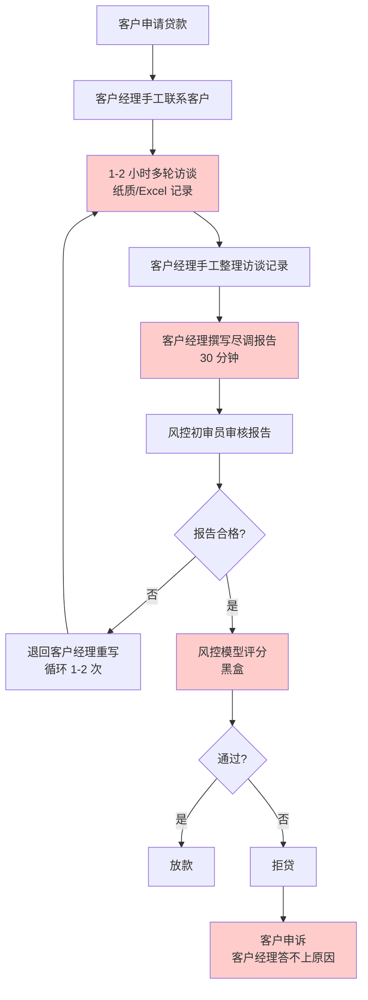
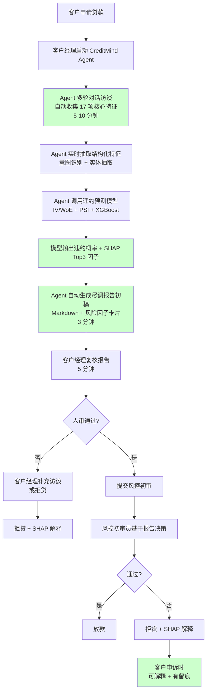
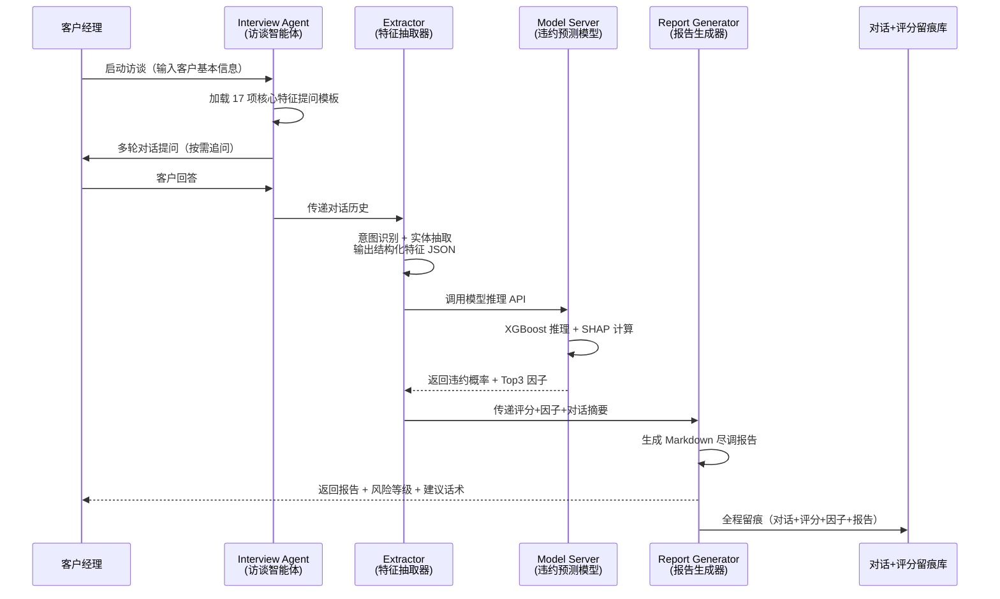

# 03 · 业务流程图（Business Flow）

> **CreditMind · AI 信贷风控大脑**
> 模块四 Day 4 业务流程 v1.0 — 2026-07-25

---

## 一、传统尽调流程（As-Is）

**痛点标注**（红色节点）：
- C：访谈 1-2 小时，重复性问题多
- E：报告 30 分钟，质量参差不齐
- I：模型黑盒，不可解释
- M：拒贷申诉答不上原因

---

## 二、CreditMind 业务流程（To-Be）

**优化标注**（绿色节点）：
- C：访谈 1-2h → 5-10min
- G：报告 30min → 3min（自动生成）
- F：模型黑盒 → SHAP + IV 双解释
- Q：拒贷申诉答不上 → 有据可查 + 全留痕

---

## 三、CreditMind 内部 Agent 工作流

---

## 四、流程对比表

| 环节 | 传统流程 | CreditMind | 改善 |
|---|---|---|---|
| 客户联系 | 手工电话/微信 | Agent 启动即用 | - |
| 访谈采集 | 1-2 小时人工 | 5-10 分钟 Agent 对话 | **-85%** |
| 信息整理 | 手工整理 Excel | 自动结构化抽取 | **-100%** |
| 报告撰写 | 30 分钟手写 | 3 分钟自动生成 | **-90%** |
| 模型评分 | 黑盒 | SHAP + IV 双解释 | **从黑到白** |
| 报告审核 | 退回率 30% | 必填校验+统一格式 | **退回率 -70%** |
| 拒贷解释 | 答不上 | SHAP Top3 自然语言 | **可解释** |
| 合规留痕 | 录音+工单 | 对话+评分+因子全留痕 | **全链路** |
| **单笔总时长** | **2-3 小时** | **15 分钟** | **-87%** |

---

## 五、关键节点说明

### 节点 1：Agent 多轮访谈（5-10 分钟）

- **输入**：客户基本信息（姓名、申请金额、用途）
- **提问模板**：基于 IV Top17 特征设计
  - int_rate / term_months / loan_amnt（贷款条件）
  - annual_inc / emp_length / home_ownership（收入资产）
  - dti / open_acc / pub_rec（信用历史）
  - inq_last_6mths / revol_util（近期行为）
  - ...
- **追问逻辑**：客户回答模糊 → Agent 追问具体数字；客户回答矛盾 → Agent 标记异常

### 节点 2：特征抽取（秒级）

- **输入**：对话历史（自然语言）
- **处理**：LLM 意图识别 + 正则/规则兜底
- **输出**：17 项结构化特征 JSON
- **兜底**：抽取失败的字段标记为"缺失"，模型按缺失值处理

### 节点 3：模型推理（秒级）

- **输入**：17 项特征 JSON
- **处理**：XGBoost 推理 + SHAP TreeExplainer
- **输出**：违约概率 + SHAP Top3 因子 + 置信度

### 节点 4：报告生成（3 分钟）

- **输入**：违约概率 + SHAP Top3 + 对话摘要
- **处理**：LLM 模板填充 + 自然语言解读
- **输出**：Markdown 尽调报告（含风险等级、关键因子、建议话术）

### 节点 5：人审复核（5 分钟）

- **客户经理**：复核报告准确性，补充主观判断
- **风控初审员**：基于报告 + 经验做最终决策
- **合规留痕**：对话+评分+因子+报告全链路存档

---

## 六、异常流程处理

| 异常场景 | 处理逻辑 |
|---|---|
| 客户拒绝回答关键问题 | Agent 标记缺失，模型按缺失值推理，报告标注"信息不全，建议人工跟进" |
| Agent 抽取的特征与客户回答矛盾 | 报告标注"回答矛盾点"，提示人审关注 |
| 模型违约概率 > 80% | 报告标注"高风险"，建议直接拒贷或加担保 |
| 模型违约概率 50-80% | 报告标注"中风险"，建议人审 + 补充材料 |
| 模型违约概率 < 50% | 报告标注"低风险"，建议快速通道 |
| Agent 对话超过 15 分钟未完成 | 自动终止 + 已采集部分送推理，报告标注"访谈未完成" |

---
*文档生成时间：2026-07-25 · 作者：尹红艳 · 项目：CreditMind 模块四路演准备*