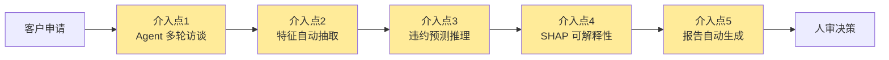

# 04 · AI 介入点说明（AI Intervention Points）

> **CreditMind · AI 信贷风控大脑**
> 模块四 Day 4 AI 介入点 v1.0 — 2026-07-25

---

## 一、AI 介入点总览

CreditMind 在传统信贷尽调流程中识别了 **5 个 AI 介入点**，每个介入点对应一个具体的 AI 能力：

---

## 二、5 个 AI 介入点详解

### 介入点 1：Agent 多轮访谈

| 维度 | 说明 |
|---|---|
| **AI 能力** | LLM 多轮对话 + 上下文管理 |
| **接管环节** | 客户经理与借款人的访谈采集 |
| **输入** | 客户基本信息（姓名、申请金额、用途） |
| **输出** | 17 项核心特征的对话历史 |
| **替代的人工** | 客户经理 1-2 小时的手工访谈 |
| **不能替代的** | 客户经理的主观判断与客户关系维护 |
| **技术栈** | LLM（DeepSeek/GPT）+ 对话状态管理 + 提问模板 |
| **效果量化** | 访谈时长 1-2h → 5-10min（-85%） |

**为什么是 AI 介入点**：
- 访谈本质是"信息采集"，规则性强、重复性高
- LLM 擅长多轮对话、按需追问、自然语言理解
- 提问模板基于 IV Top17 特征设计，**保证采集的是有预测力的信息**

---

### 介入点 2：特征自动抽取

| 维度 | 说明 |
|---|---|
| **AI 能力** | 意图识别 + 命名实体抽取（NER） |
| **接管环节** | 对话历史 → 结构化特征向量 |
| **输入** | 多轮对话的自然语言文本 |
| **输出** | 17 项结构化特征 JSON |
| **替代的人工** | 客户经理手工整理 Excel |
| **不能替代的** | 对模糊回答的人工判断 |
| **技术栈** | LLM function calling + 正则兜底 + 字段校验 |
| **效果量化** | 整理时间 30min → 秒级（-100%） |

**为什么是 AI 介入点**：
- 从非结构化文本抽取结构化字段是 NLP 经典任务
- LLM 的 function calling 能力可精准输出 JSON
- 抽取失败的字段标记为缺失，模型按缺失值处理，**不会阻断流程**

---

### 介入点 3：违约预测推理

| 维度 | 说明 |
|---|---|
| **AI 能力** | XGBoost 分类模型推理 |
| **接管环节** | 风险评分（替代黑盒模型或人工经验判断） |
| **输入** | 17 项结构化特征 JSON |
| **输出** | 违约概率（0-1）+ 风险等级（低/中/高） |
| **替代的人工** | 初审员的经验判断 |
| **不能替代的** | 初审员的最终决策权 |
| **技术栈** | XGBoost + IV/WoE + PSI 工程化特征 |
| **效果量化** | 判断标准统一，跨员工方差 -80% |

**为什么是 AI 介入点**：
- 信贷违约预测是经典 ML 任务，有充足历史数据训练
- **CreditMind 的差异化**：用 IV/WoE+PSI 工程化方法论选出 19 个稳定特征
- 对比实验已证明：AUC 0.7093，与 81 特征 baseline 相当（仅低 0.007）

---

### 介入点 4：SHAP 可解释性

| 维度 | 说明 |
|---|---|
| **AI 能力** | SHAP TreeExplainer + 自然语言解读 |
| **接管环节** | 模型决策的可解释性输出 |
| **输入** | 模型推理结果 + 特征值 |
| **输出** | SHAP Top3 因子 + 自然语言解读 |
| **替代的人工** | 数据科学家临时解释 |
| **不能替代的** | 监管现场检查的合规解释 |
| **技术栈** | SHAP + LLM 自然语言生成 |
| **效果量化** | 拒贷申诉答不上 → 有据可查 |

**为什么是 AI 介入点**：
- 模型黑盒是信贷场景最大痛点之一（痛点 B3 + C2）
- SHAP 提供全局+局部双解释，每个判断都有据可查
- LLM 把 SHAP 数值翻译成客户能懂的自然语言

---

### 介入点 5：报告自动生成

| 维度 | 说明 |
|---|---|
| **AI 能力** | LLM 模板填充 + 自然语言生成 |
| **接管环节** | 尽调报告初稿撰写 |
| **输入** | 违约概率 + SHAP Top3 + 对话摘要 |
| **输出** | Markdown 尽调报告（含风险等级、关键因子、建议话术） |
| **替代的人工** | 客户经理 30 分钟手写报告 |
| **不能替代的** | 客户经理的主观补充与复核 |
| **技术栈** | LLM + 报告模板 + Markdown 渲染 |
| **效果量化** | 报告时长 30min → 3min（-90%） |

**为什么是 AI 介入点**：
- 报告撰写是规则性强的任务，LLM 擅长结构化文本生成
- 模板化保证格式统一、必填字段不漏
- 生成的初稿由客户经理复核，**人审仍是必要的**

---

## 三、AI 介入边界（合规红线）

### ✅ AI 可以做的

1. 多轮对话采集信息
2. 从文本抽取结构化特征
3. 基于历史数据预测违约概率
4. 输出可解释的风险因子
5. 生成尽调报告初稿
6. 全链路留痕

### ❌ AI 不能做的（合规红线）

1. **不能直接做出放款/拒贷决策** — 最终决策权在人
2. **不能替代客户经理的客户关系维护** — Agent 只做信息采集
3. **不能使用 grade/sub_grade 等目标泄露特征** — 已在模型层排除
4. **不能在没有人工复核的情况下输出最终报告** — 报告初稿必须经客户经理复核
5. **不能存储客户的敏感个人信息超出业务必要范围** — 遵循 GDPR/个人信息保护法

---

## 四、AI 介入点与智能体四象限的对应

| 介入点 | 智能体象限 | 说明 |
|---|---|---|
| 介入点 1（多轮访谈） | 金融 Agent（需专业领域知识） | 信贷访谈需要领域知识设计提问 |
| 介入点 2（特征抽取） | 工具类 Agent（标准化程度高） | NER 是标准化 NLP 任务 |
| 介入点 3（违约预测） | 金融 Agent（高风险决策辅助） | 信贷风控需准确性与合规 |
| 介入点 4（SHAP 解释） | 工具类 Agent | SHAP 是标准化可解释性工具 |
| 介入点 5（报告生成） | 办公 Agent（标准化程度高） | 报告生成是写作强、AI 链成熟的任务 |

**CreditMind 是「金融 Agent × 办公 Agent」的复合体**：核心风控环节用金融 Agent（高合规），辅助环节用办公 Agent（高效率）。

---

## 五、技术栈映射

| 介入点 | 技术组件 | 复用模块三 |
|---|---|---|
| 介入点 1 | OpenClaw Agent + LLM | ✅ 复用 OpenClaw 双 Agent 架构 |
| 介入点 2 | LLM function calling + 正则 | ⚠️ 新增 |
| 介入点 3 | XGBoost + IV/WoE + PSI | ✅ 复用 V1.ipynb + V2.md |
| 介入点 4 | SHAP TreeExplainer | ✅ 复用 V1.ipynb |
| 介入点 5 | LLM + Markdown 模板 | ⚠️ 新增 |

---
*文档生成时间：2026-07-25 · 作者：尹红艳 · 项目：CreditMind 模块四路演准备*