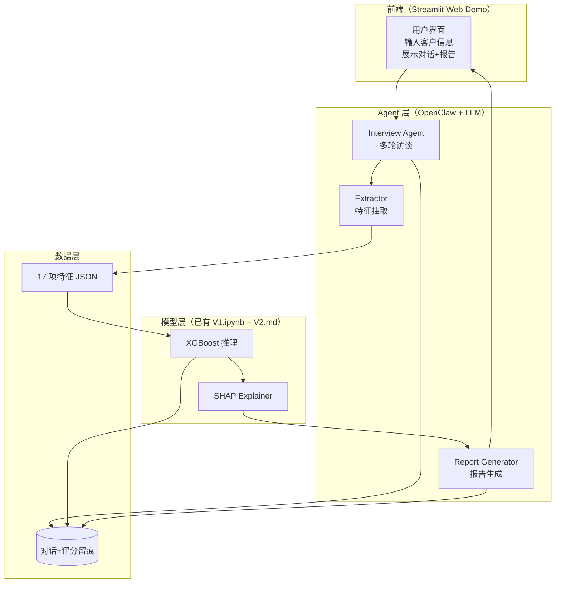

# 05 · MVP 功能清单（MVP Features）

> **CreditMind · AI 信贷风控大脑**
> 模块四 Day 4 MVP 清单 v1.0 — 2026-07-25

---

## 一、MVP 范围定义

### MVP 目标

在 **5 天**内做出一个**可演示的最小闭环**：

> 客户经理输入一个虚拟借款人 → Agent 多轮访谈 → 模型推理 → 生成尽调报告

### MVP 边界

| 包含 | 不包含 |
|---|---|
| 单轮输入 + Agent 多轮访谈 | 多用户并发 |
| 17 项核心特征采集 | 多模态 OCR（身份证/流水） |
| XGBoost 违约预测 | 实时交易系统对接 |
| SHAP Top3 可解释性 | 模型校准（Isotonic） |
| Markdown 报告生成 | Word/PDF 导出 |
| Web Demo（Streamlit） | 生产级部署（Docker/K8s） |
| 本地 Agent（OpenClaw） | 企业级 SaaS |

---

## 二、功能清单（MoSCoW 优先级）

### Must Have（必须有，5 天内完成）

| ID | 功能 | 描述 | 验收标准 |
|---|---|---|---|
| **M1** | Agent 多轮访谈 | 基于提问模板与客户对话 | 能完成 17 项核心特征采集，对话流畅 |
| **M2** | 特征自动抽取 | 从对话历史抽取结构化 JSON | 17 项特征抽取准确率 ≥ 80% |
| **M3** | 违约预测模型 | 调用 XGBoost 推理 | 输出违约概率 + 风险等级 |
| **M4** | SHAP 可解释性 | 输出 Top3 风险因子 | 因子排序正确 + 数值合理 |
| **M5** | 报告自动生成 | Markdown 尽调报告 | 含风险等级 + 因子 + 建议话术 |
| **M6** | Web Demo | Streamlit 界面 | 可现场演示完整闭环 |
| **M7** | 虚拟借款人 Case | 预设一个演示用例 | 35 岁深圳电商老板借 20 万 |

### Should Have（应该有，时间允许则做）

| ID | 功能 | 描述 | 验收标准 |
|---|---|---|---|
| **S1** | 异常值检测 | 客户回答矛盾时标记 | 报告标注"回答矛盾点" |
| **S2** | 风险等级分档 | 低/中/高三档建议 | 概率 <50% 低，50-80% 中，>80% 高 |
| **S3** | 对话留痕 | 全程对话存档 | 可回溯访谈过程 |
| **S4** | 多 Case 演示 | 2-3 个预设 Case | 低风险 + 中风险 + 高风险各一个 |

### Could Have（可以有，Phase 2 考虑）

| ID | 功能 | 描述 |
|---|---|---|
| **C1** | OCR 身份证识别 | 多模态采集 |
| **C2** | 银行流水解析 | 自动提取收入流水 |
| **C3** | Word/PDF 导出 | 报告格式标准化 |
| **C4** | 模型校准 | Isotonic / Platt |
| **C5** | FastAPI 后端 | 生产级 API |
| **C6** | Docker 部署 | 容器化 |

### Won't Have（本期不做）

| ID | 功能 | 原因 |
|---|---|---|
| **W1** | 直接放款决策 | 合规红线，AI 不做最终决策 |
| **W2** | 多用户并发 | MVP 范围控制 |
| **W3** | 企业级 SaaS | 超出 5 天 MVP |
| **W4** | 实时交易系统对接 | 超出 MVP 范围 |

---

## 三、MVP 功能架构图

---

## 四、5 天开发计划

| Day | 任务 | 产出 |
|---|---|---|
| **Day 1** | 环境搭建 + 复用 V1/V2 模型 | `model_server.py`（XGBoost + SHAP 推理 API） |
| **Day 2** | Agent 多轮访谈 + 提问模板 | `interview_agent.py`（17 项特征采集） |
| **Day 3** | 特征抽取 + 报告生成 | `extractor.py` + `report_generator.py` |
| **Day 4** | Streamlit Web Demo + 虚拟 Case | `app.py` + 3 个演示 Case |
| **Day 5** | 路演彩排 + 文档完善 | 路演 PPT + Demo 演示脚本 |

---

## 五、技术栈选型

| 层 | 技术 | 选型理由 |
|---|---|---|
| 前端 | Streamlit | Python 原生，快速搭建 Demo |
| Agent | OpenClaw + DeepSeek API | 复用模块三架构 |
| 模型 | XGBoost + SHAP | 复用 V1.ipynb |
| 特征工程 | optbinning（IV/WoE）+ 自实现 PSI | 复用 V2.md 方法论 |
| 数据 | SQLite（留痕） | 轻量级，MVP 够用 |
| 部署 | 本地运行 | MVP 不上云 |

---

## 六、MVP 验收标准（Definition of Done）

### 功能验收

- [ ] 输入虚拟借款人信息，Agent 能完成多轮访谈
- [ ] 17 项核心特征抽取准确率 ≥ 80%
- [ ] 模型输出违约概率 + 风险等级
- [ ] SHAP Top3 因子正确输出
- [ ] Markdown 尽调报告自动生成
- [ ] Streamlit Web Demo 可现场演示

### 演示验收

- [ ] 3 个预设 Case（低/中/高风险）均能跑通
- [ ] 单笔闭环时长 ≤ 15 分钟
- [ ] 路演现场可互动演示（输入新 Case）

### 文档验收

- [ ] PRD v0.1 完成
- [ ] 路演材料初稿完成
- [ ] 代码 README 完成

---
*文档生成时间：2026-07-25 · 作者：尹红艳 · 项目：CreditMind 模块四路演准备*